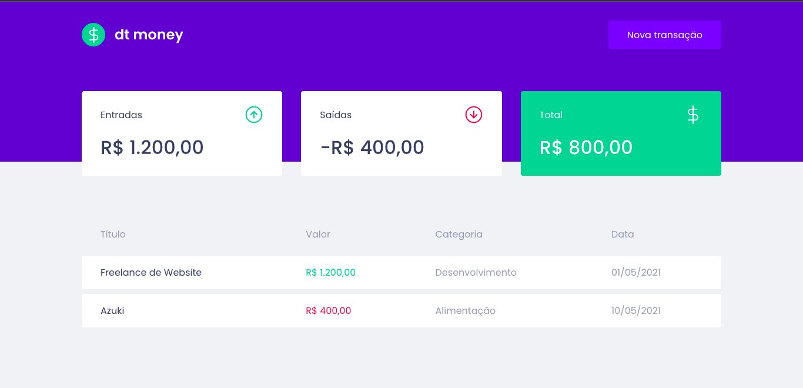
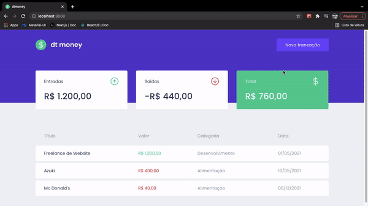

<h1 align="center">Manage Your Money</h1>

# 🎥 Overview:





<br />

# 💻 Project:

This project was built to help people organize their daily finantial transactions. <br /> <br />
You can register the transaction as a income or outcome, adding a category to it (example: food, leisure, work etc). <br /> <br />
I used MirageJS to build a fake API and add some fake data to the application, and made the API calls with Axios.

<br />

# ⚡ Technologies:

### • ReactJS

### • Styled Components

### • Typescript

### • MirageJS

### • Axios

<br />

# How to run

```
# Clone this repository
$ git clone https://github.com/keyyuwan/manageyourmoney

# Go to the directory
$ cd manageyourmoney

# Install Dependencies
$ yarn

# Run Web Server
$ yarn start
```
